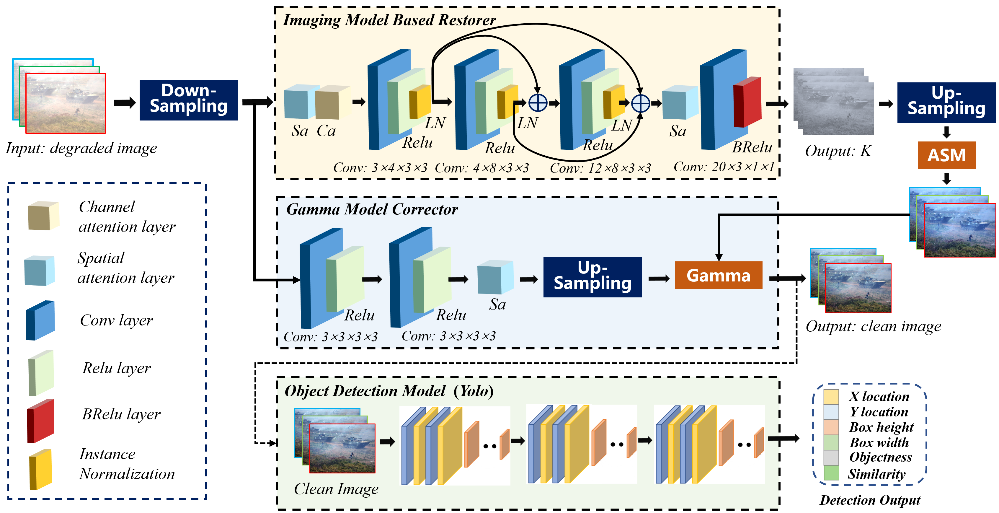
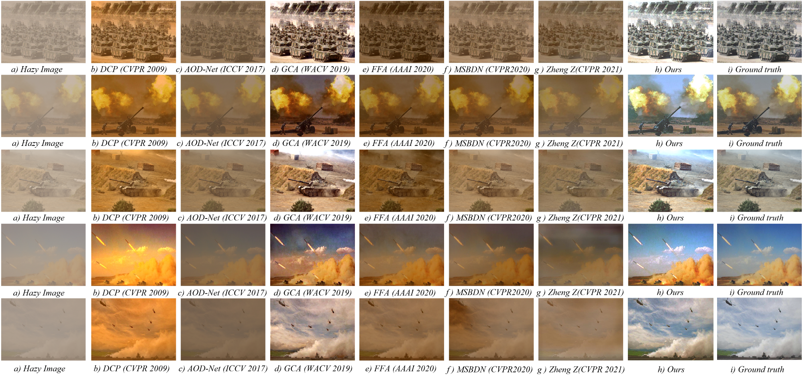
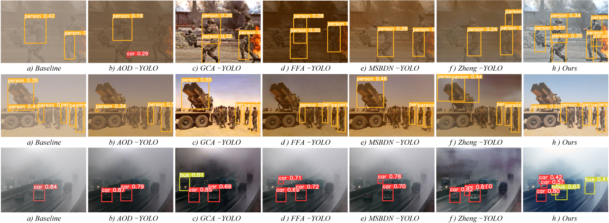

## Image Recovery and Object Detection Integrated Algorithms for Robots in Harsh Battlefield Environments
Xudong Wang, Xi’ai Chen, Feifan Wang, Chonglong Xu, Yandong Tang  
  

## Our work 

Battlefield environments are harsher than normal environments, and the images captured by imaging equipment are more prone to degradation. Degraded images seriously affect the analysis of military intelligence and the deployment of intelligent weapons. To address this issue, we propose an image recovery algorithm, which recovers degraded battlefield images based on a physical imaging model and uses a light-weight network to estimate the parameters of physical model. In addition, we propose a strategy to joint training of the image recovery module and the object detection module. Specifically, we integrate the recovery module to the front of YOLO detector to jointly optimize the two modules with detection loss. The image recovery module is lightweight without significant adverse impact on the real-time running of object detection, which can be easily deployed to intelligent unmanned devices such as battlefield robots. The experimental results show that the proposed algorithm achieves better recovery performance in battlefield environments, and the joint training strategy effectively improve the
accuracy of object detection.

  &emsp;&emsp; 

## Dependencies
* Python 3.8
* PyTorch 1.8.1 + cu111
* torchvision 0.9.1 + cu111
* numpy
* opencv-python
* skimage
* hiddenlayer
* matplotlib
* PIL
* math
* os
## Architecture
model.py: The definition of the model class.

utils.py: Some tools for network training and testing.

data.py: Preparation tools for the training dataset.

test.py: Quick dehazing test for hazy images.

testall.py: Dehazing test for all hazy images dataset.

train.py: Training the dehazing model by supervised learning.

## Test
1. Please put the images to be tested into the ``test_images`` folder. We have prepared the images of the experimental results in the paper.
2. Please run the ``test.py``, then you will get the following results:

  &emsp;&emsp; 

  &emsp;&emsp; 

